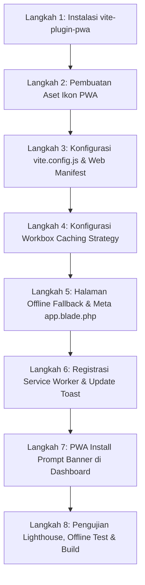

# 📱 Rencana Eksekusi Integrasi PWA (Progressive Web App)
## Proyek SIPINJAM — Sistem Peminjaman Sarana & Prasarana STITEK Bontang

---

## 1. Ringkasan Eksekutif & Batasan Level Integrasi

Berdasarkan analisis arsitektur **Laravel 12 + Inertia.js (Vue 3) + Vite (VILT Stack)** pada SIPINJAM, integrasi PWA akan difokuskan pada **Level 1, Level 2, dan Level 3** (dengan fondasi siap pakai untuk **Level 5 Push Notification** di masa mendatang).

### Matriks Target Level Integrasi:
| Level | Fitur Utama | Status Target | Alasan / Manfaat |
| :--- | :--- | :---: | :--- |
| **Level 1** | **Installable App & Standalone Shell** | ✅ **Fase 1** | Aplikasi dapat di-install di Android, iOS, Windows, dan macOS dengan icon resmi, splash screen, dan tanpa address bar browser. |
| **Level 2** | **Asset Pre-Caching & Offline Fallback** | ✅ **Fase 1** | Seluruh bundle JS, CSS, Font Inter, dan logo di-cache lokal. Saat koneksi terputus, aplikasi tetap terbuka dengan halaman offline ramah pengguna. |
| **Level 3** | **Read-Only Offline Data Caching** | ✅ **Fase 2** | Halaman statis dan penting seperti **Tata Tertib**, **Kalender Akademik**, dan **Katalog Sarpras** tetap dapat dibaca penuh saat mahasiswa tidak memiliki sinyal internet. |
| **Level 4** | **Offline Booking Mutation** | ❌ *Diabaikan* | *Tidak diterapkan* karena peminjaman kampus memerlukan verifikasi jadwal dan stok real-time langsung ke database server untuk mencegah *double-booking*. |
| **Level 5** | **Web Push Notification** | ⏳ *Fase Lanjutan* | Fondasi Service Worker disiapkan untuk menerima push notification status persetujuan surat dari admin. |

---

## 2. Rincian Teknis & Arsitektur PWA

- **Vite PWA Engine**: `vite-plugin-pwa` (Workbox)
- **Theme Color**: `#2563eb` (User Blue) & `#ea580c` (Admin Accent)
- **Background Color**: `#ffffff`
- **Display Mode**: `standalone` (Fullscreen native-app experience)
- **Orientation**: `portrait-primary` / `any`
- **Scope & Start URL**: `/`

---

## 3. Tahapan Rencana Eksekusi (Step-by-Step)



---

### Langkah 1: Instalasi Dependensi
Memasang plugin resmi Vite untuk PWA:
```bash
npm install -D vite-plugin-pwa
```

---

### Langkah 2: Pembuatan Aset Ikon PWA Standar
Menyiapkan ikon aplikasi beresolusi tinggi dengan berbagai variasi di folder `public/`:
1. `public/pwa-192x192.png` (Standard Icon Android/Mobile)
2. `public/pwa-512x512.png` (High-res Icon Desktop/Splash)
3. `public/pwa-maskable-512x512.png` (Adaptive Icon dengan safe zone lingkaran/kotak)
4. `public/apple-touch-icon.png` (Icon khusus iOS Safari 180x180)
5. `public/favicon.svg` / `public/favicon.ico`

---

### Langkah 3: Konfigurasi Web App Manifest & Vite
Mengonfigurasi `VitePWA` pada [vite.config.js](file:///d:/KOD%20ING/sipinjam-vilt-capstone/vite.config.js):
```javascript
VitePWA({
  registerType: 'autoUpdate',
  includeAssets: ['favicon.ico', 'apple-touch-icon.png', 'logo.png', 'image/*.png', 'image/*.jpg'],
  manifest: {
    name: 'SIPINJAM - Sistem Peminjaman Sarpras STITEK',
    short_name: 'SiPinjam',
    description: 'Sistem Peminjaman Ruangan dan Barang Kampus STITEK Bontang',
    theme_color: '#2563eb',
    background_color: '#ffffff',
    display: 'standalone',
    start_url: '/',
    icons: [
      {
        src: '/pwa-192x192.png',
        sizes: '192x192',
        type: 'image/png'
      },
      {
        src: '/pwa-512x512.png',
        sizes: '512x512',
        type: 'image/png'
      },
      {
        src: '/pwa-maskable-512x512.png',
        sizes: '512x512',
        type: 'image/png',
        purpose: 'maskable any'
      }
    ],
    shortcuts: [
      {
        name: 'Mulai Pinjam',
        url: '/dashboard?action=pinjam',
        icons: [{ src: '/pwa-192x192.png', sizes: '192x192' }]
      },
      {
        name: 'Riwayat Peminjaman',
        url: '/bookings',
        icons: [{ src: '/pwa-192x192.png', sizes: '192x192' }]
      },
      {
        name: 'Tata Tertib',
        url: '/tata_tertib',
        icons: [{ src: '/pwa-192x192.png', sizes: '192x192' }]
      }
    ]
  }
})
```

---

### Langkah 4: Strategi Caching Workbox (Offline-Ready)
Menambahkan aturan caching pada `workbox` di `vite.config.js`:
- **Core Assets (`.js`, `.css`, `.woff2`)**: Pre-cached saat instalasi.
- **Images & Icons (`/image/`, `/resources/images/`)**: `CacheFirst` dengan masa berlaku 30 hari (maksimal 60 entri).
- **Halaman Statis Inertia (`/tata_tertib`, `/kalender`)**: `StaleWhileRevalidate` — data ditampilkan instan dari cache lokal, lalu diperbarui di background saat ada koneksi.
- **Katalog Aset (`/ruangan`, `/barang`)**: `NetworkFirst` dengan timeout 3 detik sebelum fallback ke cache lokal terakhir.

---

### Langkah 5: Halaman Offline Fallback & Meta Tags Blade
1. **Membuat file `public/offline.html`**:
   - Tampilan UI bergaya modern (Inter font, icon `WifiOff`, tombol *Coba Lagi* dan *Buka Tata Tertib Tersimpan*).
2. **Memperbarui [resources/views/app.blade.php](file:///d:/KOD%20ING/sipinjam-vilt-capstone/resources/views/app.blade.php)**:
   ```html
   <!-- PWA Primary Meta Tags -->
   <meta name="theme-color" content="#2563eb">
   <meta name="apple-mobile-web-app-capable" content="yes">
   <meta name="apple-mobile-web-app-status-bar-style" content="default">
   <meta name="apple-mobile-web-app-title" content="SiPinjam">
   <link rel="apple-touch-icon" href="/apple-touch-icon.png">
   <link rel="manifest" href="/build/manifest.webmanifest">
   ```

---

### Langkah 6: Komponen PWA UI (Install Banner & Update Prompt)
1. **Service Worker Registration Handler** (`resources/js/pwa.js`):
   - Mendaftarkan Service Worker dan menangani event `beforeinstallprompt`.
2. **Banner Installasi di User Dashboard**:
   - Memberikan kartu sugesti estetis: *"Pasang Aplikasi SIPINJAM di Layar Utama untuk Akses Lebih Cepat"* dengan tombol *"Install"* dan opsi *"Nanti Saja"*.
3. **Pemberitahuan Pembaruan Versi (*Auto-Update Toast*)**:
   - Menampilkan toast elegan saat ada versi web baru yang di-deploy: *"Pembaruan aplikasi tersedia. [Klik Muat Ulang]"*.

---

### Langkah 7: Pengujian, Validasi & QA
1. **Lighthouse PWA Audit**:
   - Target Skor PWA: **100/100** (Installable, Valid Manifest, Service Worker registered, Maskable Icon, Fast on 3G).
2. **Pengujian Mode Offline**:
   - Simulasi Chrome DevTools `Network: Offline` untuk memastikan halaman **Tata Tertib** dan **Katalog** tetap dapat dibaca.
3. **Pengujian Multi-Perangkat**:
   - Desktop Chrome/Edge (*App Install Button di URL bar*).
   - Android Chrome (*Add to Home Screen banner & APK generation*).
   - iOS Safari (*Share -> Add to Home Screen*).
4. **Verifikasi Build**:
   - Menjalankan `npm run build` dan `php artisan test` (memastikan 212 tests tetap lulus 100%).

---

## 4. Rencana Mitigasi Risiko & Rollback
- **Cache Invalidation**: Menggunakan hash nama file bawaan Vite (`[name]-[hash].js`) sehingga tidak akan terjadi isu *stale cache* lama saat update dideploy.
- **Bypass untuk Endpoint Dinamis**: Endpoint transaksi booking, upload file, dan API otentikasi (`/bookings`, `/lapor-pelanggaran`, `/login`, `/logout`) dikonfigurasi sebagai `NetworkOnly` untuk menjamin integritas data transaksi.

---

> ℹ️ **Status**: Perencanaan telah terdokumentasi lengkap dan siap dieksekusi begitu Anda memberikan instruksi konfirmasi.
