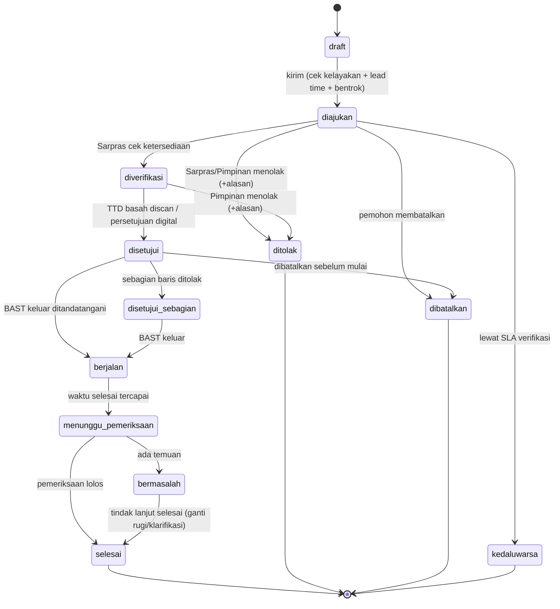

# Rencana Penyempurnaan SiPinjam menuju Rilis Produksi

**Dokumen**: Riset SOP, Audit Gap, dan Blueprint Perubahan
**Versi**: 1.0
**Tanggal**: 6 September 2026
**Basis kode**: `belpythons/sipinjam-vilt-capstone` @ `8ad8a38` (branch kerja: `claude/campus-asset-lending-app-7vlx9u`)
**Stack**: Laravel 11 · Vue 3 · Inertia 3 · Tailwind 3 · Spatie Permission · Spatie PDF (Browsershot)

> Dokumen ini berisi **analisis dan rencana**. Perintah eksekusi teknis (prompt siap pakai per fase) berada di file terpisah: [`PROMPT-EKSEKUSI.md`](./PROMPT-EKSEKUSI.md).

---

## Daftar Isi

1. [Ringkasan Eksekutif](#1-ringkasan-eksekutif)
2. [Riset: Bagaimana Peminjaman Aset Kampus Bekerja](#2-riset-bagaimana-peminjaman-aset-kampus-bekerja)
3. [Audit Kondisi Aplikasi Saat Ini](#3-audit-kondisi-aplikasi-saat-ini)
4. [Analisis Gap: SOP Nyata vs Aplikasi](#4-analisis-gap-sop-nyata-vs-aplikasi)
5. [Blueprint Perubahan](#5-blueprint-perubahan)
   - 5.1 [Pilar 1 — Transparansi, Log Riwayat & Surat Resmi](#51-pilar-1--transparansi-log-riwayat--surat-resmi)
   - 5.2 [Pilar 2 — PWA & Mobile-First](#52-pilar-2--pwa--mobile-first)
   - 5.3 [Pilar 3 — Multi-Peran, Paket Event & Kepatuhan SOP](#53-pilar-3--multi-peran-paket-event--kepatuhan-sop)
   - 5.4 [Pilar 4 — Audit UI/UX, Onboarding & Konsistensi Desain](#54-pilar-4--audit-uiux-onboarding--konsistensi-desain)
6. [Model Data Target](#6-model-data-target)
7. [Mesin Status & Alur Lengkap](#7-mesin-status--alur-lengkap)
8. [Temuan Bug & Risiko Produksi](#8-temuan-bug--risiko-produksi)
9. [Peta Jalan (Roadmap) & Estimasi](#9-peta-jalan-roadmap--estimasi)
10. [Definition of Done / Checklist Rilis](#10-definition-of-done--checklist-rilis)
11. [Keputusan yang Butuh Konfirmasi Anda](#11-keputusan-yang-butuh-konfirmasi-anda)
12. [Referensi](#12-referensi)

---

## 1. Ringkasan Eksekutif

SiPinjam saat ini adalah **MVP demo yang solid untuk presentasi capstone**, tetapi belum siap dipakai sebagai sistem operasional kampus. Fondasinya bagus (VILT, locking pesimistik, delayed stock deduction, generator nomor surat, scheduler sanksi), namun ada empat kesenjangan struktural terhadap yang Anda minta:

| # | Yang Anda Minta | Kondisi Sekarang | Status |
| :-- | :--- | :--- | :--- |
| 1 | Transparansi + log riwayat + output surat sesuai SOP lama | Log hanya 4 status tanpa jejak aktor/waktu; surat hanya 1 jenis, tanda tangan **di-hardcode nama fiktif**; aplikasi memposisikan diri sebagai *pemberi keputusan*, bukan *pencatat* | 🔴 Belum sesuai |
| 2 | PWA + maksimal di mobile + pop-up install tiap login | **Tidak ada PWA sama sekali** (tanpa manifest/service worker); layout memakai sidebar `ml-64` **tanpa satu pun breakpoint responsif** — tidak bisa dipakai di HP | 🔴 Belum ada |
| 3 | Semua sivitas boleh pinjam; paket event sekali ajukan; deteksi ketidakpatuhan; ban + ganti rugi; wajib nomor WA | Hanya 2 peran (`admin`/`user`); **1 pengajuan = 1 aset saja**; tidak ada pemeriksaan pengembalian; ban otomatis tanpa bukti; **kolom nomor WA tidak ada** dan integrasi Fonnte hanya ada di README, **tidak diimplementasikan** | 🔴 Belum sesuai |
| 4 | Audit UI/UX, panduan user baru, konsistensi desain | 770 kelas warna hardcoded vs 427 token semantik; 2 konvensi folder komponen; tabel admin tanpa fallback mobile; **tidak ada onboarding sama sekali** | 🟠 Perlu perombakan |

**Rekomendasi**: kerjakan dalam **9 fase** (P0–P8), ±6–8 minggu untuk 1–2 developer. Fase P0 (perbaikan bug blocker) dan P1 (fondasi data) wajib selesai sebelum fase lain, karena seluruh fitur baru bertumpu pada model data baru.

**Perubahan paradigma paling penting**: aplikasi berhenti berperan sebagai *pengambil keputusan* dan berubah menjadi **sistem pencatatan + penerbit dokumen**. SOP basah (tanda tangan fisik) tetap berjalan; aplikasi menyiapkan surat, mencatat siapa menandatangani kapan, menyimpan scan, dan mengekspos jejaknya secara transparan.

---

## 2. Riset: Bagaimana Peminjaman Aset Kampus Bekerja

Riset dilakukan terhadap SOP publik dari UI, UII, UGM, IPB, UB, Unpar, PNJ, Esa Unggul, ITS, UAD, dan beberapa politeknik/STIK. Meski redaksionalnya berbeda, polanya sangat konsisten.

### 2.1 Aktor dan Perannya

| Aktor | Peran dalam SOP | Padanan di sistem |
| :--- | :--- | :--- |
| **Pemohon** | Mahasiswa (pribadi/ormawa), dosen, tenaga kependidikan/staf | Role `mahasiswa`, `dosen`, `staff` |
| **Penanggung Jawab (PJ) Kegiatan** | Orang yang bertanggung jawab fisik atas aset selama kegiatan; wajib dapat dihubungi | Field `pj_nama`, `pj_phone` di pengajuan |
| **Pembina / Kaprodi / Atasan** | Memberi rekomendasi "mengetahui" untuk kegiatan mahasiswa | Blok tanda tangan "Mengetahui" pada surat |
| **Pengelola Aset / Sarpras / BAUK** | Cek ketersediaan, jadwal, kelayakan; menyiapkan aset | Role `staf_aset` (verifikator) |
| **Pejabat Penyetuju** | Wakil Ketua II / Direktur Umum / Kabag Umum — menandatangani Surat Izin | Role `pimpinan` (approver) |
| **Petugas Serah Terima** | Laboran/security/OB — serah terima kunci & barang, pemeriksaan kembali | Role `staf_aset` (petugas) |

**Temuan kunci #1**: SOP kampus **tidak pernah** hanya melibatkan "user" dan "admin". Minimal ada pemisahan **verifikator ketersediaan** dan **pejabat penyetuju**. Aplikasi yang menggabungkan keduanya ke satu tombol "Setujui" tidak dapat merepresentasikan SOP nyata.

### 2.2 Dokumen yang Beredar

| Dokumen | Kapan terbit | Ditandatangani |
| :--- | :--- | :--- |
| **Surat Permohonan Peminjaman** | Sebelum diajukan | Pemohon/Ketua Pelaksana + PJ + Pembina/Kaprodi (mengetahui) |
| **Proposal / TOR Kegiatan** (event besar) | Lampiran permohonan | Ketua Pelaksana + Ketua Ormawa + Pembina |
| **Surat Izin / Persetujuan Peminjaman** | Setelah disetujui | Pejabat berwenang (Warek/Waket II/Direktur Umum) |
| **Berita Acara Serah Terima (BAST) Keluar** | Saat aset diambil | Petugas + Peminjam |
| **Berita Acara Pengembalian & Pemeriksaan** | Saat aset dikembalikan | Petugas + Peminjam |
| **Berita Acara Kerusakan/Kehilangan + Surat Pernyataan Ganti Rugi** | Bila ada temuan | Peminjam + Petugas + saksi |
| **LPJ Kegiatan** | H+7 setelah kegiatan (event besar) | Ketua Pelaksana + Pembina |

**Temuan kunci #2**: Surat yang paling penting bukan hanya satu. Alur nyata butuh **minimal 4 dokumen**: Permohonan → Izin → BAST Keluar → BA Pengembalian. Aplikasi sekarang hanya punya satu ("Surat Izin Peminjaman Aset") dan hanya bisa diunduh setelah admin klik setujui.

### 2.3 Tenggat Waktu (Lead Time) yang Umum

| Objek | Lead time pengajuan | Sumber pola |
| :--- | :--- | :--- |
| Ruangan/Gedung untuk kegiatan besar | **H-7 s.d. H-14 hari kerja** | UI (7 hari kerja, verifikasi 7–14 hari kerja), Unpar (2 minggu) |
| Ruang kelas/rapat rutin | H-2 s.d. H-3 hari kerja | Politeknik/STIK |
| Barang/alat lab | H-1 s.d. H-3 hari kerja | UGM PIKA, ITS, UAD |
| Penyerahan LPJ | **H+7 setelah kegiatan** | UB, Unpar |

**Temuan kunci #3**: Aplikasi sekarang mengizinkan booking untuk **hari ini juga** (`after_or_equal:today`) tanpa lead time minimum. Ini tidak realistis dan membuat surat resmi kehilangan makna (surat izin yang terbit di hari-H tidak sempat ditandatangani pejabat).

### 2.4 Pemeriksaan Saat Pengembalian

SOP pengembalian barang inventaris secara konsisten menuntut:
1. Identifikasi **jumlah, kondisi, ukuran, spesifikasi** barang saat kembali.
2. Pembuatan **Berita Acara Serah Terima** yang diverifikasi, ditandatangani, dan **diarsipkan**.
3. Untuk ruangan: pemeriksaan kebersihan, kelengkapan/kembalinya tata letak, kondisi AC/proyektor/listrik, kunci.

**Temuan kunci #4**: Aplikasi sekarang **tidak memiliki entitas pemeriksaan sama sekali**. Tombol "Selesai" milik admin langsung mengembalikan stok tanpa mencatat kondisi. Fitur "Lapor Berantakan" ada, tetapi menebak-nebak siapa pelakunya dengan query heuristik tanggal — sumber kesalahan penetapan sanksi.

### 2.5 Sanksi dan Ganti Rugi

Pola sanksi yang ditemukan di lapangan:

| Pelanggaran | Sanksi umum |
| :--- | :--- |
| Terlambat mengembalikan | Denda harian per alat (mis. Rp10.000/alat/hari); pencatatan sebagai pertimbangan izin berikutnya |
| Terlambat berulang / merugikan pihak lain | **Larangan menggunakan fasilitas 1–6 bulan** |
| Barang rusak atau hilang | **Wajib mengganti dengan barang yang sama atau senilai**; segala kerusakan sejak serah terima s.d. pengembalian adalah tanggung jawab peminjam |
| Ruangan ditinggal kotor/rusak | Teguran → sanksi larangan pinjam; biaya kebersihan dibebankan |
| LPJ telat | Ormawa tidak boleh mengajukan proposal/peminjaman baru |

**Temuan kunci #5**: Sanksi nyata bersifat **berjenjang dan berbasis bukti**, bukan biner. Aplikasi sekarang langsung memblokir 30 hari untuk pelanggaran apa pun, otomatis, tanpa bukti, tanpa pemberitahuan, tanpa mekanisme banding. Ini berisiko secara etis dan administratif.

### 2.6 Prinsip yang Diturunkan dari Riset

1. **Aplikasi adalah pencatat, bukan pemutus.** Keputusan tetap di tangan pejabat; aplikasi menyiapkan dokumen dan merekam keputusan.
2. **Satu kegiatan = satu berkas.** Panitia mengajukan satu surat untuk aula + 200 kursi + 2 proyektor, bukan lima surat.
3. **Setiap perpindahan tanggung jawab wajib punya berita acara.** Keluar dan kembali.
4. **Setiap sanksi wajib punya bukti dan pelaku yang pasti.** Bukan hasil tebakan query.
5. **Kontak PJ yang aktif adalah syarat mutlak**, karena eskalasi kerusakan terjadi di dunia nyata, bukan di aplikasi.

---

## 3. Audit Kondisi Aplikasi Saat Ini

### 3.1 Yang Sudah Baik (Pertahankan)

- `BookingService` dengan `DB::transaction` + `lockForUpdate` — pencegahan race condition sudah benar secara prinsip.
- **Delayed stock deduction** (stok baru dipotong saat approve) — keputusan desain yang tepat.
- `Peminjaman::generateNomorSurat()` — format `001/INT/SIPINJAM/2026` sudah menyerupai konvensi surat kampus.
- Design token HSL sudah terpasang di `resources/css/app.css` + `tailwind.config.js` (shadcn-style) — fondasi konsistensi sudah ada, tinggal ditegakkan.
- Komponen UI dasar (`button`, `card`, `dialog`, `select`, `tabs`, `tooltip`) sudah tersedia.
- `CheckUserBlocked` middleware + gate blokir di login sudah ada.
- Scheduler (`booking:auto-reject` per jam, `sanction:apply` harian) sudah terpasang di `routes/console.php`.
- Ada test: `BookingRaceConditionTest`, `SipinjamFeaturesTest`, `Auth`, `ProfileTest`.

### 3.2 Inventaris Kode

```
app/
  Console/Commands/     ApplySanctionPenalties, AutoRejectPendingBookings
  Http/Controllers/     Admin/AdminController (≈400 baris, God controller)
                        Booking, Ruangan, Barang, Calendar, Dashboard,
                        Landing, Profile, Report, TataTertib, Auth/*
  Models/               User, Peminjaman, Barang, Ruangan, Calendar, Banner, TataTertib(kosong)
  Services/             BookingService, ImageService
  Policies/             BookingPolicy
database/migrations/    21 file (peminjamans ditambal 6× secara inkremental)
resources/js/           24 halaman Vue (4.712 baris), 2 layout, 4 komponen, 12 primitif UI
resources/views/        11 blade (PDF, email, laporan admin)
```

### 3.3 Skema `peminjamans` Saat Ini

```
id, user_id, tipe(ruangan|barang), barang_id?, ruangan_id?, nama_item, jumlah,
tanggal, tanggal_mulai, tanggal_selesai, jam_mulai, jam_selesai,
keterangan, status(menunggu|sedang_dipinjam|selesai|ditolak),
nomor_surat, approved_at, completed_at, timestamps
```

Masalah struktural:
- Kolom `tanggal` yatim (tidak dipakai) berdampingan dengan `tanggal_mulai`/`tanggal_selesai`.
- `tanggal_*` bertipe `date` dan `jam_*` bertipe `time` terpisah → pengecekan bentrok harus memakai `CONCAT`/`||` yang **berbeda per driver DB** dan **tidak bisa memakai index** (lihat `BookingService::assertNoScheduleConflict`).
- `nama_item` menduplikasi relasi (denormalisasi tanpa alasan).
- Satu baris = satu aset → mustahil merepresentasikan paket event.
- Tidak ada kolom untuk aktor keputusan (`approved_by`, `verified_by`, `rejected_by`), alasan penolakan, atau jejak.

---

## 4. Analisis Gap: SOP Nyata vs Aplikasi

Legenda: ✅ ada & benar · 🟡 ada tapi tidak memadai · 🔴 tidak ada

| Aspek SOP | Aplikasi | Ket |
| :--- | :--: | :--- |
| Multi-peran pemohon (mhs/dosen/staf) | 🔴 | Hanya `admin` & `user`; tidak ada NIM/NIP, prodi/unit, jabatan |
| Identitas & kontak PJ kegiatan | 🔴 | Tidak ada field sama sekali; **nomor WA tidak ada di tabel users** |
| Pengajuan paket event (banyak aset sekaligus) | 🔴 | 1 pengajuan = 1 aset; panitia harus submit berulang kali |
| Pengajuan aset tunggal (barang saja / ruangan saja) | ✅ | Sudah bisa |
| Lead time minimum (H-7/H-14) | 🔴 | Boleh booking hari ini juga |
| Lampiran proposal/TOR | 🔴 | Tidak ada upload berkas |
| Verifikasi ketersediaan oleh Sarpras (terpisah dari persetujuan) | 🔴 | Satu tombol "Setujui" merangkap semuanya |
| Persetujuan berjenjang pejabat | 🔴 | Tidak ada rantai persetujuan |
| Surat Permohonan (untuk ditandatangani pemohon+pembina) | 🔴 | Tidak ada |
| Surat Izin resmi ber-nomor | 🟡 | Ada, tapi **penanda tangan di-hardcode**: "Aisyah Rahmawati, S.Kom. NIP: 2024090123" dan "Ketua Panitia" |
| Unggah scan surat bertanda tangan basah | 🔴 | Tidak ada |
| BAST Keluar (serah terima aset) | 🔴 | Tidak ada |
| Berita Acara Pengembalian & pemeriksaan kondisi | 🔴 | Tombol "Selesai" langsung mengembalikan stok tanpa catatan kondisi |
| Checklist kebersihan ruangan + foto bukti | 🟡 | Hanya "Lapor Berantakan" berupa teks, pelaku ditebak lewat query tanggal |
| Pencatatan kerusakan/kehilangan | 🔴 | Tidak ada |
| Ganti rugi & nilai kerugian | 🔴 | Tidak ada; tidak ada `nilai_perolehan` pada barang |
| Sanksi berjenjang berbasis bukti | 🔴 | Blokir 30 hari otomatis, seragam, tanpa bukti/notifikasi/banding |
| Riwayat/jejak audit yang transparan | 🔴 | Hanya kolom status; tidak ada siapa/kapan/mengapa |
| Notifikasi WhatsApp | 🔴 | **Didokumentasikan di README, nol implementasi** (`grep fonnte` = 0 hasil di `app/`) |
| Notifikasi email | 🟡 | Mailable ada tapi **dinonaktifkan** (`⛔ DISABLED for MVP` di `BookingService`) |
| PWA / installable | 🔴 | Tidak ada manifest, service worker, ikon PWA |
| Layout mobile | 🔴 | `ml-64` tanpa breakpoint; sidebar & layout punya **0 prefix responsif** |
| Panduan pengguna baru | 🔴 | Tidak ada onboarding/tour/halaman panduan |
| Konsistensi desain | 🟡 | 770 warna hardcoded vs 427 token; 2 konvensi folder komponen |

---

## 5. Blueprint Perubahan

### 5.1 Pilar 1 — Transparansi, Log Riwayat & Surat Resmi

**Prinsip**: *aplikasi mencatat, SOP lama tetap berjalan, output aplikasi adalah surat siap tanda tangan.*

#### 5.1.1 Mode Persetujuan (dapat dikonfigurasi)

`config/sipinjam.php` → `approval_mode`:

| Mode | Perilaku | Untuk siapa |
| :--- | :--- | :--- |
| `hybrid` **(default)** | Aplikasi menerbitkan **Surat Permohonan** untuk dicetak & ditandatangani basah. Petugas mengunggah scan + mencatat tanggal/nama penanda tangan → status menjadi `disetujui` → aplikasi menerbitkan **Surat Izin** ber-nomor. | Kampus yang SOP-nya masih berbasis kertas (kasus Anda) |
| `digital` | Persetujuan penuh di aplikasi oleh role `pimpinan`; surat tetap terbit dengan blok TTD + QR verifikasi. | Bila kampus siap paperless |
| `manual` | Aplikasi hanya mencatat hasil (arsip), tanpa alur persetujuan. | Masa transisi/pilot |

#### 5.1.2 Berkas Dokumen yang Dihasilkan

| Kode | Dokumen | Terbit pada status | Blok tanda tangan |
| :--- | :--- | :--- | :--- |
| `surat_permohonan` | Surat Permohonan Peminjaman + lampiran rincian aset | `diajukan` | Pemohon/Ketua Pelaksana · PJ Kegiatan · Pembina/Kaprodi/Atasan (mengetahui) |
| `surat_izin` | Surat Izin Peminjaman Aset ber-nomor | `disetujui` | Pejabat berwenang (dari `config/sipinjam.php`) · Pengelola Aset |
| `bast_keluar` | Berita Acara Serah Terima (keluar) + checklist kondisi awal | `berjalan` | Petugas · Peminjam |
| `bast_kembali` | Berita Acara Pengembalian & Pemeriksaan | `selesai`/`bermasalah` | Petugas pemeriksa · Peminjam |
| `ba_kerusakan` | Berita Acara Kerusakan/Kehilangan + Surat Pernyataan Ganti Rugi | saat pelanggaran `rusak`/`hilang` | Peminjam · Petugas · Saksi |

Semua dokumen: kop surat & penanda tangan **dari konfigurasi**, bukan hardcode. Setiap dokumen mendapat `nomor`, `hash` isi, dan `qr_token` yang mengarah ke halaman verifikasi publik `/verifikasi/{token}` (menampilkan: nomor surat, pemohon, aset, tanggal, status — tanpa data pribadi sensitif).

> **Wajib diperbaiki**: `resources/views/pdf/surat-peminjaman.blade.php` saat ini memuat nama & NIP penanda tangan fiktif yang di-hardcode, serta menulis "Jumlah: 1 Unit" secara statis padahal kolom `jumlah` sudah ada. Untuk rilis, ini adalah cacat dokumen resmi.

#### 5.1.3 Log Riwayat & Transparansi

Tabel append-only `pengajuan_timeline` mencatat setiap peristiwa: `aksi`, `dari_status`, `ke_status`, `actor_id`, `actor_role`, `catatan`, `meta(json)`, `ip`, `created_at`. Tidak pernah di-update/hapus.

Ekspos ke tiga permukaan:
1. **Halaman detail pengajuan (pemohon)** — timeline vertikal: "Diajukan 12 Sep 09:14 · Diverifikasi Sarpras (Budi) 12 Sep 14:02 · Disetujui Waket II 13 Sep 10:30 · Surat terbit No. 045/INT/SIPINJAM/2026".
2. **Papan transparansi publik** `/transparansi` — kalender & daftar pemakaian aset yang sudah disetujui (nama kegiatan + unit + slot waktu; **tanpa** kontak pribadi). Menjawab "siapa memakai aula Sabtu depan?" tanpa harus bertanya ke staf.
3. **Ekspor audit (admin)** — CSV/PDF seluruh jejak per periode, untuk kebutuhan audit internal/BAN-PT.

### 5.2 Pilar 2 — PWA & Mobile-First

#### 5.2.1 Instalasi PWA

- Paket: `vite-plugin-pwa` (strategi `generateSW` dengan Workbox).
- `manifest.webmanifest`: `name: "SiPinjam — Peminjaman Aset Kampus"`, `short_name: "SiPinjam"`, `id: "/"`, `start_url: "/dashboard"`, `scope: "/"`, `display: "standalone"`, `orientation: "portrait"`, `theme_color: "#2563eb"`, `background_color: "#ffffff"`, `lang: "id"`.
- Ikon: 192, 512, dan **512 maskable** (wajib agar ikon tidak "kotak putih" di Android), plus `apple-touch-icon` 180×180.
- `screenshots` (form_factor `narrow` & `wide`) → memicu UI instalasi yang lebih kaya di Chrome Android.
- `shortcuts`: "Ajukan Peminjaman", "Riwayat Saya", "Cek Ketersediaan".

#### 5.2.2 Strategi Caching (jujur soal keterbatasan)

Inertia **membutuhkan server untuk setiap navigasi**, jadi aplikasi ini tidak bisa sepenuhnya offline. Yang realistis:

| Aset | Strategi |
| :--- | :--- |
| Build JS/CSS (`build/assets/*`) | Precache |
| Ikon, logo, font (self-hosted) | CacheFirst, 1 tahun |
| Foto ruangan/barang (`/storage/*`) | StaleWhileRevalidate, maks 200 entri / 30 hari |
| Navigasi Inertia | NetworkOnly + fallback `/offline` |
| `POST`/mutasi | **Tidak di-cache** (jangan pernah cache mutasi) |

Halaman `/offline` menampilkan pesan ramah + tombol "Coba lagi" + info kontak WA admin.

#### 5.2.3 Pop-up Instalasi Setiap Login (permintaan eksplisit)

Komponen `InstallPwaPrompt.vue`:

```
Server (HandleInertiaRequests) membagikan:
  pwa.shouldPrompt = true  ← di-set sekali per sesi login,
                              dimatikan bila user memilih "Jangan tampilkan lagi"
                              (kolom users.pwa_prompt_dismissed_at)
```

Perilaku per platform:

| Platform | Perilaku |
| :--- | :--- |
| Chrome/Edge Android & Desktop | Tangkap `beforeinstallprompt`, tahan event-nya, tampilkan **bottom sheet** kustom → tombol "Pasang Aplikasi" memanggil `prompt()` |
| **iOS Safari** | `beforeinstallprompt` **tidak pernah dipicu Safari**. Tampilkan instruksi bergambar: *"Ketuk ikon Bagikan → Tambahkan ke Layar Utama"* |
| Sudah terpasang | Deteksi `matchMedia('(display-mode: standalone)')` atau `navigator.standalone` → **jangan tampilkan** |
| Firefox Android | Tampilkan instruksi menu → "Install" |

Tombol yang tersedia: **Pasang** · **Nanti saja** (snooze 7 hari, `localStorage`) · **Jangan tampilkan lagi** (persisten di profil, lintas perangkat). Event `appinstalled` dicatat ke server untuk statistik adopsi.

> Catatan desain: permintaan Anda "pop up setiap kali login" dipenuhi sebagai perilaku default. Opsi snooze/opt-out tetap disediakan agar tidak menjadi *prompt fatigue* — pengguna yang sudah memasang atau menolak permanen tidak akan diganggu lagi. Ini praktik yang direkomendasikan dan tidak mengurangi cakupan permintaan.

#### 5.2.4 Perombakan Layout Mobile (blocker terbesar)

Kondisi sekarang: `UserLayout.vue` dan `AdminLayout.vue` = `<main class="ml-64">` dengan sidebar `fixed w-64`, **tanpa satu pun prefix `sm:`/`md:`/`lg:`**. Di layar 360px, konten terdorong keluar viewport.

Target `AppShell.vue` (dipakai user & admin, dibedakan lewat prop `nav`):

```
< lg  : TopAppBar (judul + aksi) · konten · BottomNav 5 item · Drawer off-canvas untuk menu penuh
≥ lg  : Sidebar permanen 264px · konten
```

- BottomNav user: **Beranda · Ruangan · Barang · Riwayat · Profil**
- BottomNav admin: **Beranda · Pengajuan · Aset · Pemeriksaan · Lainnya**
- FAB "Ajukan Peminjaman" di mobile.
- `padding-bottom: env(safe-area-inset-bottom)` untuk iPhone.
- Target sentuh ≥ 44×44px; `font-size: 16px` pada input (mencegah auto-zoom iOS).
- Semua `<table>` admin (KelolaPeminjaman, KelolaUser, KelolaBarang, KelolaRuangan, Dashboard) mendapat komponen `<ResponsiveTable>`: tabel di `lg+`, daftar kartu di mobile.
- `BookingModal` menjadi **full-screen sheet** di mobile (saat ini `sm:max-w-lg` dengan `max-h-[90vh]` yang memotong konten di HP kecil).

### 5.3 Pilar 3 — Multi-Peran, Paket Event & Kepatuhan SOP

#### 5.3.1 Peran & Kelayakan Meminjam

Role Spatie yang baru:

| Role | Boleh mengajukan | Kewenangan tambahan |
| :--- | :--: | :--- |
| `mahasiswa` | ✅ | Wajib mencantumkan pembina/ormawa untuk kegiatan organisasi |
| `dosen` | ✅ | Boleh mengajukan atas nama prodi; lead time lebih pendek (konfigurasi) |
| `staff` (tendik) | ✅ | Boleh mengajukan atas nama unit kerja |
| `staf_aset` | — | Verifikasi ketersediaan, serah terima, pemeriksaan, catat pelanggaran |
| `pimpinan` | — | Menyetujui/menolak, menandatangani surat |
| `admin` | ✅ | Superset; kelola master data, user, sanksi, konfigurasi |

Aturan kelayakan (`EligibilityService`) — semua dapat dikonfigurasi:
1. Akun terverifikasi (email kampus) **dan** nomor WA terverifikasi.
2. Tidak sedang kena sanksi aktif.
3. Tidak melebihi kuota pengajuan aktif bersamaan (default: mahasiswa 3, dosen/staf 5).
4. Tidak punya LPJ/pengembalian tertunggak.
5. Aset yang diminta boleh diakses role tersebut (mis. lab tertentu hanya dosen).
6. **Kegiatan harus berkaitan dengan kampus** — diwujudkan sebagai field wajib `jenis_kegiatan` (Akademik/Kemahasiswaan/Kedinasan/Pengabdian/Lainnya) + `unit_penyelenggara` + pernyataan tercentang, yang seluruhnya tercetak di surat dan menjadi dasar verifikasi Sarpras.

Login Google dibatasi domain kampus (`@stitek.ac.id`) — lihat [§8](#8-temuan-bug--risiko-produksi).

#### 5.3.2 Pengajuan Paket Event (Keranjang Aset)

Ini perubahan fungsional terbesar. Alur baru:

```
Dashboard → "Ajukan Peminjaman"
 └─ Langkah 1  Jenis pengajuan:  ○ Aset Tunggal   ● Paket Kegiatan/Event
 └─ Langkah 2  Identitas kegiatan: nama kegiatan, jenis, unit/ormawa,
               jumlah peserta, PJ (nama + WA), deskripsi, upload proposal (opsional/wajib untuk event)
 └─ Langkah 3  Jadwal utama (mulai–selesai) + opsi jadwal berbeda per aset
 └─ Langkah 4  KERANJANG ASET  — cari & tambah ruangan/barang, atur jumlah & jadwal per baris,
               indikator ketersediaan real-time per baris, deteksi bentrok langsung
 └─ Langkah 5  Ringkasan + centang tata tertib + kirim
       ↓
 SATU nomor pengajuan · SATU surat permohonan (dengan lampiran tabel seluruh aset)
```

Jalur "Aset Tunggal" tetap ada: dari halaman Ruangan/Barang, tombol "Pinjam" langsung membuka form ringkas berisi 1 baris keranjang — tetap 1 pengajuan, tetapi tanpa langkah identitas kegiatan yang panjang.

Persetujuan **per baris** dimungkinkan: Sarpras dapat menyetujui aula tetapi menolak 2 dari 5 proyektor (stok kurang), dengan alasan tercatat per baris. Status header dihitung dari agregat baris (`disetujui_sebagian`).

#### 5.3.3 Ketersediaan Berbasis Waktu (mengganti `stok_tersedia`)

Masalah sekarang: `barangs.stok_tersedia` adalah penghitung yang bisa berubah, dipotong saat approve dan dikembalikan saat selesai. Konsekuensinya (lihat [§8](#8-temuan-bug--risiko-produksi)) sistem menolak peminjaman bulan depan hanya karena stok habis hari ini.

Ganti dengan `AvailabilityService`:

```
tersedia(barang, mulai, selesai)
  = stok_total
  − Σ jumlah dari pengajuan_items berstatus {disetujui, berjalan}
      yang rentang waktunya beririsan dengan [mulai, selesai)
  − Σ jumlah yang tercatat rusak/hilang (belum diganti)
  − Σ jumlah yang sedang dalam pemeliharaan (asset_blackouts)
```

Untuk ruangan: sama, dengan kapasitas 1 dan mempertimbangkan **buffer bersih-bersih** (`config: buffer_menit`, default 30) agar dua kegiatan tidak menempel persis.

Ini juga menghilangkan kebutuhan `stok_tersedia` yang rawan tidak sinkron. Kolom tetap dipertahankan sebagai *cache* yang di-recompute, bukan sumber kebenaran.

#### 5.3.4 Pemeriksaan Serah Terima & Pengembalian

Entitas `serah_terima` (tipe `keluar` / `kembali`) per baris aset:

**Checklist Keluar (BAST)** — kondisi awal, jumlah diserahkan, foto, penerima, petugas, waktu.

**Checklist Kembali** — dua template yang dapat dikonfigurasi:

| Ruangan | Barang |
| :--- | :--- |
| Kebersihan lantai & meja | Jumlah kembali sesuai |
| Sampah dibuang | Kondisi fisik (baik/lecet/rusak ringan/rusak berat/hilang) |
| Tata letak kursi/meja dikembalikan | Kelengkapan aksesori (kabel, remote, tas) |
| AC/lampu/proyektor dimatikan | Berfungsi normal saat diuji |
| Kunci dikembalikan | Kebersihan alat |
| Tidak ada kerusakan fasilitas | — |

Setiap item checklist: `ya/tidak/tidak berlaku` + catatan + **foto bukti (wajib bila "tidak")**. Hasil pemeriksaan → status `selesai` (semua lolos) atau `bermasalah` (ada temuan) → otomatis membuat record `pelanggaran`.

**Pelaku dipastikan dari data, bukan tebakan**: `pelanggaran.user_id` diambil dari `pengajuan.user_id` dan `pengajuan.pj_*` pada baris yang diperiksa — bukan dari query "peminjaman terakhir di ruangan ini hari ini" seperti `laporBerantakan()` sekarang.

Mode lapangan: halaman pemeriksaan dioptimalkan untuk HP (PWA) — buka dari HP di depan ruangan, centang, foto langsung dari kamera, submit.

#### 5.3.5 Pelanggaran, Sanksi Berjenjang & Ganti Rugi

Tabel `pelanggaran` (jenis: `terlambat`, `tidak_bersih`, `rusak_ringan`, `rusak_berat`, `hilang`, `tidak_digunakan`, `lpj_telat`) dengan poin, bukti foto, dan status tindak lanjut.

Matriks sanksi (di `config/sipinjam.php`, dapat diubah tanpa deploy):

| Akumulasi poin / jenis | Sanksi |
| :--- | :--- |
| Terlambat < 24 jam, pertama kali | Peringatan tercatat (poin 1) |
| Terlambat ≥ 24 jam atau pelanggaran ke-2 | Blokir 7 hari |
| Pelanggaran ke-3 dalam 1 semester | Blokir 30 hari |
| Ruangan ditinggal kotor/rusak | Poin 2 + kewajiban klarifikasi |
| Barang rusak/hilang | **Blokir sampai ganti rugi selesai** + BA Kerusakan + nilai ganti dari `barangs.nilai_perolehan` |
| LPJ telat > 7 hari (event) | Blokir pengajuan baru bagi PJ & ormawa sampai LPJ masuk |

Kelengkapan yang wajib ada agar sanksi sah:
- **Notifikasi WA + email** saat sanksi dijatuhkan, memuat: jenis pelanggaran, bukti, masa berlaku, cara mengajukan keberatan.
- **Mekanisme keberatan/banding**: user dapat mengirim sanggahan; admin dapat `mencabut` sanksi dengan alasan tercatat (kolom `dicabut_oleh`, `dicabut_at`, `alasan_pencabutan`).
- **Papan ganti rugi (admin)**: daftar tunggakan berisi pelaku, kontak WA, aset, nilai, status (`menunggu` → `disepakati` → `lunas`), lampiran bukti pembayaran/penggantian.
- Blokir otomatis dari scheduler **hanya boleh** dijatuhkan bila ada record `pelanggaran` — tidak boleh langsung dari kalkulasi waktu (lihat bug B-04 di [§8](#8-temuan-bug--risiko-produksi)).

#### 5.3.6 Nomor WhatsApp & Layanan Notifikasi

**Ini belum ada sama sekali di kode.** Yang perlu dibangun:

1. Kolom `users.phone` (disimpan **ternormalisasi E.164**, mis. `+6281234567890`), `phone_verified_at`, `phone_verification_*`.
2. Middleware `EnsureProfileComplete`: setelah login, bila `phone` kosong atau belum terverifikasi → paksa ke `/onboarding/kontak`. Tidak bisa mengajukan peminjaman sebelum terverifikasi.
3. `WhatsappService` (driver Fonnte, sesuai README) + antarmuka `WhatsappDriver` agar mudah diganti (Fonnte → Wablas → WA Cloud API) tanpa mengubah pemanggil. Semua pengiriman lewat **queued job** dengan retry & backoff; kegagalan tercatat di `notification_logs` (bukan `throw` yang menggagalkan transaksi bisnis).
4. Verifikasi OTP 6 digit: kadaluwarsa 10 menit, maksimal 5 percobaan, throttle 1 kirim/60 detik, kode disimpan **ter-hash**.
5. Template pesan (semua bahasa Indonesia, tanpa jargon):
   - Pengajuan diterima + nomor pengajuan
   - Diverifikasi Sarpras / Ditolak + alasan
   - Disetujui + tautan unduh Surat Izin
   - Pengingat H-1 dan H-2 jam sebelum mulai
   - Pengingat pengembalian (T-2 jam & saat jatuh tempo)
   - Peringatan keterlambatan
   - Hasil pemeriksaan bermasalah + tindak lanjut
   - Sanksi dijatuhkan / dicabut
   - Tagihan ganti rugi
6. **Privasi (UU PDP No. 27/2022)**: nomor WA hanya terlihat penuh oleh `admin`/`staf_aset`; untuk peran lain ditampilkan tersamar (`+62812****7890`). Sertakan teks persetujuan pemrosesan data saat onboarding, dan catat setiap akses ke data kontak di log audit.
7. Tombol "Hubungi via WA" (`wa.me`) di panel admin untuk eskalasi manual — sesuai `VITE_ADMIN_WA_NUMBER` yang sudah ada di `.env.example`.

### 5.4 Pilar 4 — Audit UI/UX, Onboarding & Konsistensi Desain

#### 5.4.1 Temuan Audit UI/UX

| # | Temuan | Dampak | Perbaikan |
| :-- | :--- | :--- | :--- |
| U-01 | Layout `ml-64` tanpa breakpoint | **Aplikasi tak terpakai di HP** | `AppShell` responsif + BottomNav (§5.2.4) |
| U-02 | 770 kelas warna hardcoded vs 427 token semantik | Warna sama punya banyak versi; tema tidak bisa diubah | Migrasi ke token; tambah token `success`/`warning`/`info` |
| U-03 | Dua konvensi folder: `resources/js/Components` (kapital) & `resources/js/components/ui` (kecil) | Rawan gagal build di server Linux (case-sensitive) | Satukan ke `resources/js/Components/**` |
| U-04 | Label status ditulis ulang di banyak file (`sedang_dipinjam` → berbagai teks) | Inkonsistensi bahasa | Satu sumber: `resources/js/lib/status.js` |
| U-05 | Tabel admin tanpa fallback mobile | Scroll horizontal, tak terbaca | `<ResponsiveTable>` |
| U-06 | Tidak ada empty state | Halaman kosong membingungkan | Komponen `<EmptyState>` + CTA di semua daftar |
| U-07 | Tidak ada loading/skeleton state | Terasa "hang" saat request lambat | `<Skeleton>` + indikator progres Inertia |
| U-08 | Flash message hanya di-share, penyajian tidak seragam | Notifikasi kadang tidak muncul | Komponen `<Toast>` global di `AppShell` |
| U-09 | Tidak ada konfirmasi destruktif yang seragam | Risiko hapus tak sengaja | `<ConfirmDialog>` untuk semua aksi hapus/tolak/blokir |
| U-10 | Error validasi hanya di bawah field, tidak diringkas | Di form 5 langkah, user tidak tahu error ada di langkah mana | Ringkasan error di header + badge merah pada stepper |
| U-11 | `@import` Google Fonts di `app.css` | Render-blocking; **font gagal saat offline (PWA)** | Self-host Inter (`@fontsource/inter`) |
| U-12 | Template PDF memuat `<script src="https://cdn.tailwindcss.com">` | **PDF gagal/berantakan bila server tanpa akses internet** | CSS PDF di-compile & di-inline |
| U-13 | Tidak ada dukungan dark mode meski token siap | — | Tambah blok `.dark` (opsional, P7) |
| U-14 | Aksesibilitas: kontras `text-blue-200/70` di sidebar < 4.5:1; ikon tanpa `aria-label`; fokus keyboard tak terlihat di beberapa tombol kustom | Tidak lolos WCAG AA | Perbaiki kontras, tambah `aria-*`, `focus-visible:ring` |
| U-15 | Semua teks di-hardcode di komponen | Sulit dikoreksi/konsisten | Berkas i18n `lang/id.json` untuk teks UI utama |
| U-16 | Tidak ada penanganan sesi kedaluwarsa (419) di PWA | User terjebak layar error | Interceptor Inertia → arahkan ke login dengan pesan |

#### 5.4.2 Sistem Desain yang Ditegakkan

Perluas `Design System Guide .md` menjadi acuan operasional + tambahkan token:

```
--success / --success-foreground     (hijau — selesai, lolos periksa)
--warning / --warning-foreground     (kuning — menunggu, hampir jatuh tempo)
--info    / --info-foreground        (biru muda — informasi)
--surface / --surface-muted          (latar section)
```

Peta status → warna (satu sumber kebenaran, `lib/status.js`):

| Status | Warna | Ikon |
| :--- | :--- | :--- |
| `draft` | muted | FileEdit |
| `diajukan` | info | Send |
| `diverifikasi` | info | ClipboardCheck |
| `disetujui` | primary | CheckCircle2 |
| `berjalan` | warning | PlayCircle |
| `menunggu_pemeriksaan` | warning | Search |
| `selesai` | success | CheckCheck |
| `bermasalah` | destructive | AlertTriangle |
| `ditolak` | destructive | XCircle |
| `dibatalkan` / `kedaluwarsa` | muted | Ban |

Komponen yang perlu ditambahkan ke pustaka UI: `Table`, `Alert`, `Toast`, `Sheet`, `DropdownMenu`, `Checkbox`, `RadioGroup`, `Textarea`, `Skeleton`, `EmptyState`, `Pagination`, `Stepper`, `FileUpload`, `PhotoCapture`, `ConfirmDialog`, `PageHeader`, `StatusBadge`, `ResponsiveTable`, `Timeline`, `BottomNav`, `InstallPwaPrompt`.

#### 5.4.3 Panduan Pengguna Baru

Empat lapis, dari yang paling memaksa sampai paling pasif:

1. **Onboarding wajib (sekali)** — 3 langkah setelah login pertama:
   `Lengkapi identitas (NIM/NIP, prodi/unit)` → `Verifikasi nomor WA (OTP)` → `Baca & setujui Tata Tertib (versi tercatat)`.
   Persetujuan disimpan di `user_agreements` (user, versi tata tertib, waktu, IP) — inilah dasar hukum penegakan sanksi.
2. **Tur produk (dapat dilewati, dapat diulang)** — 5–7 langkah sorotan di Dashboard: di mana cek ketersediaan, di mana ajukan, di mana lihat status, di mana unduh surat, di mana lihat sanksi. Tombol "?" di app bar untuk memutar ulang kapan saja.
3. **Halaman `/panduan`** — panduan bergambar per peran (Mahasiswa · Dosen/Staf · Petugas Aset), alur SOP dalam diagram, FAQ, contoh surat, dan tombol unduh "Panduan Singkat (PDF)".
4. **Bantuan kontekstual** — teks pembantu di bawah setiap field penting, tooltip pada istilah (PJ, BAST, lead time), empty state yang mengajari (mis. "Belum ada pengajuan. Mulai dengan mengecek ketersediaan ruangan →"), dan banner di form event yang mengingatkan lead time H-7.

---

## 6. Model Data Target

### 6.1 Tabel Baru

| Tabel | Isi utama |
| :--- | :--- |
| `pengajuan` | `kode`, `user_id`, `jenis(tunggal\|event)`, `nama_kegiatan`, `jenis_kegiatan`, `unit_penyelenggara`, `jumlah_peserta`, `pj_nama`, `pj_phone`, `deskripsi`, `lampiran_proposal`, `mulai_at`, `selesai_at`, `status`, `nomor_surat`, `submitted_at`, `verified_by/at`, `approved_by/at`, `rejected_by/at`, `alasan_penolakan`, `scan_surat_path`, `ttd_basah_at`, timestamps, soft deletes |
| `pengajuan_items` | `pengajuan_id`, `assetable_type/id` (Ruangan\|Barang), `jumlah`, `mulai_at`, `selesai_at`, `status_item`, `alasan_tolak`, `catatan` |
| `pengajuan_timeline` | `pengajuan_id`, `actor_id`, `actor_role`, `aksi`, `dari_status`, `ke_status`, `catatan`, `meta(json)`, `ip`, `created_at` (append-only) |
| `serah_terima` | `pengajuan_item_id`, `tipe(keluar\|kembali)`, `petugas_id`, `waktu`, `jumlah`, `kondisi`, `checklist(json)`, `foto(json)`, `catatan`, `ttd_peminjam_path` |
| `pelanggaran` | `user_id`, `pengajuan_item_id`, `jenis`, `poin`, `deskripsi`, `bukti(json)`, `nilai_ganti_rugi`, `status_tindak_lanjut`, `dicatat_oleh`, `catatan_penyelesaian` |
| `sanksi` | `user_id`, `pelanggaran_id`, `jenis(peringatan\|blokir)`, `mulai_at`, `sampai_at`, `alasan`, `dibuat_oleh`, `dicabut_oleh/at`, `alasan_pencabutan` |
| `dokumen` | `pengajuan_id`, `jenis`, `nomor`, `path`, `hash`, `qr_token`, `dibuat_oleh`, `created_at` |
| `asset_blackouts` | `assetable_type/id`, `mulai_at`, `selesai_at`, `alasan(pemeliharaan\|libur\|acara_internal)` |
| `phone_verifications` | `user_id`, `phone`, `code_hash`, `expires_at`, `attempts`, `verified_at` |
| `notification_logs` | `user_id`, `kanal(wa\|email)`, `template`, `payload(json)`, `status`, `error`, `sent_at` |
| `tata_tertib_versions` | `versi`, `konten`, `berlaku_sejak`, `dibuat_oleh` |
| `user_agreements` | `user_id`, `tata_tertib_version_id`, `disetujui_at`, `ip` |
| `settings` | key-value untuk kop surat, penanda tangan, jam operasional, denda (dengan cache) |

### 6.2 Perubahan Tabel Lama

**`users`** — tambah: `phone`, `phone_verified_at`, `identity_number` (NIM/NIP), `user_type`, `program_studi`, `unit_kerja`, `jabatan`, `angkatan`, `poin_pelanggaran`, `pwa_prompt_dismissed_at`, `onboarding_completed_at`. Pertahankan `is_blocked`/`blocked_until`/`blocked_reason` sebagai **cache** yang diturunkan dari tabel `sanksi`.

**`barangs`** — tambah: `nilai_perolehan`, `satuan`, `kondisi`, `lokasi_penyimpanan`, `is_consumable`, `butuh_operator`, `min_lead_time_jam`, `role_diizinkan(json)`.

**`ruangans`** — tambah: `fasilitas(json)`, `jam_buka`, `jam_tutup`, `buffer_menit`, `pengelola_unit`, `butuh_persetujuan_khusus`, `min_lead_time_jam`, `role_diizinkan(json)`.

**`peminjamans`** — **dimigrasikan** menjadi `pengajuan` + `pengajuan_items` (1 baris lama → 1 header + 1 item), lalu tabel lama di-*rename* menjadi `peminjamans_legacy` (read-only) selama 1 rilis sebelum dihapus. Migrasi data ditulis sebagai perintah artisan `sipinjam:migrate-legacy` yang idempoten + dapat di-rollback.

### 6.3 Indeks yang Diperlukan

- `pengajuan_items` : `(assetable_type, assetable_id, mulai_at, selesai_at)` ← inti pengecekan bentrok
- `pengajuan_items` : `(status_item, mulai_at)`
- `pengajuan` : `(status, submitted_at)`, `(user_id, status)`, unique `kode`, unique `nomor_surat`
- `pengajuan_timeline` : `(pengajuan_id, created_at)`
- `pelanggaran` : `(user_id, created_at)`, `(status_tindak_lanjut)`
- `sanksi` : `(user_id, sampai_at)`

> **Catatan penting**: dengan `mulai_at`/`selesai_at` sebagai kolom `datetime` tunggal, pengecekan bentrok menjadi `mulai_at < :req_end AND selesai_at > :req_start` — **dapat memakai indeks** dan **portabel lintas driver**, menggantikan `CONCAT`/`||` bercabang yang ada sekarang.

---

## 7. Mesin Status & Alur Lengkap

### 7.1 Diagram Status Pengajuan



Semua transisi diimplementasikan di `PengajuanStateMachine` — satu-satunya tempat status boleh berubah, dan setiap transisi **wajib** menulis `pengajuan_timeline`.

### 7.2 Alur Pengguna End-to-End (mode `hybrid`)

| # | Aktor | Tindakan | Output sistem |
| :-- | :--- | :--- | :--- |
| 1 | Pemohon | Cek ketersediaan di kalender/katalog | Slot bebas terlihat real-time |
| 2 | Pemohon | Isi form (tunggal/paket), unggah proposal | `pengajuan` + `pengajuan_items`, status `diajukan` |
| 3 | Sistem | Validasi kelayakan, lead time, bentrok, kuota | Ditolak otomatis bila gagal, dengan alasan jelas |
| 4 | Sistem | Terbitkan **Surat Permohonan (PDF)** | Notifikasi WA: "Pengajuan #SPJ-2026-0123 diterima. Unduh & tandatangani surat permohonan." |
| 5 | Pemohon | Cetak, tanda tangan (pemohon + PJ + pembina), serahkan fisik | — |
| 6 | Staf Aset | Verifikasi ketersediaan & kelengkapan berkas | Status `diverifikasi`, timeline tercatat |
| 7 | Pimpinan | Tanda tangan Surat Izin (fisik) | — |
| 8 | Staf Aset | Unggah scan surat + catat tanggal/nama penanda tangan | Status `disetujui`, **nomor surat terbit**, PDF Surat Izin tersedia |
| 9 | Sistem | Notifikasi WA + email ke pemohon & PJ | Tautan unduh Surat Izin |
| 10 | Sistem | Pengingat H-1 dan T-2 jam | — |
| 11 | Petugas | Serah terima aset + checklist kondisi awal + foto | **BAST Keluar**, status `berjalan` |
| 12 | Sistem | Pengingat pengembalian (T-2 jam, jatuh tempo) | — |
| 13 | Petugas | Pemeriksaan pengembalian di HP: checklist + foto | **BA Pengembalian**; `selesai` atau `bermasalah` |
| 14 | Sistem | Bila bermasalah → buat `pelanggaran` + hitung sanksi | Notifikasi WA berisi temuan, bukti, sanksi, cara keberatan |
| 15 | Admin | Kelola ganti rugi sampai lunas | Sanksi dicabut, timeline tercatat |
| 16 | Publik | Lihat `/transparansi` | Jadwal pemakaian aset terbuka |

---

## 8. Temuan Bug & Risiko Produksi

Ditemukan saat audit kode; **semua harus dibereskan sebelum rilis**.

| ID | Berkas | Temuan | Tingkat |
| :--- | :--- | :--- | :--- |
| **B-01** | `ReportController::userIndex()` | Mengembalikan `view('user.laporan')` — **berkas blade-nya tidak ada** (`resources/views/user/` hanya berisi `kalender/`). Rute `/laporan` yang ada di sidebar user akan **error 500**. | 🔴 Blocker |
| **B-02** | `BookingService::approveBooking()` | Saat stok jadi 0, **semua** pengajuan `menunggu` untuk barang itu ditolak — termasuk yang jadwalnya bulan depan. Stok habis hari ini tidak berarti habis bulan depan. | 🔴 Kritis |
| **B-03** | `BookingService::approveBooking()` | Bentrok jadwal ruangan hanya dicek saat **membuat**, tidak saat **menyetujui**. Dua pengajuan `menunggu` di slot sama bisa **dua-duanya disetujui**. | 🔴 Kritis |
| **B-04** | `ApplySanctionPenalties` | Memblokir user 30 hari hanya karena status masih `sedang_dipinjam` lewat 12 jam — **padahal barang mungkin sudah dikembalikan** dan admin belum sempat klik "Selesai". Memblokir **tanpa notifikasi apa pun**. Juga memuat **seluruh** booking aktif ke memori tanpa `chunk`. | 🔴 Kritis |
| **B-05** | `AdminController::laporBerantakan()` | Menentukan pelaku lewat tebakan query ("peminjaman selesai terakhir di ruangan ini hari ini"), lalu memblokir. **Berpotensi menghukum orang yang salah.** | 🔴 Kritis |
| **B-06** | `AutoRejectPendingBookings` | Menimpa kolom `keterangan` dengan "Dibatalkan sistem: Melewati SLA 48 jam" — **menghapus keperluan yang ditulis pemohon**. Sama di B-02. | 🟠 Tinggi |
| **B-07** | `SocialiteController` | Login Google menerima **email apa pun** (termasuk Gmail pribadi) dan otomatis membuat akun `user`. Tidak ada whitelist domain kampus. | 🔴 Kritis (keamanan) |
| **B-08** | `resources/views/pdf/surat-peminjaman.blade.php` | Memuat `https://cdn.tailwindcss.com` dan Google Fonts → **PDF gagal/berantakan di server tanpa akses internet keluar**; juga memperlambat setiap render. | 🔴 Blocker |
| **B-09** | `resources/views/pdf/surat-peminjaman.blade.php` | Nama & NIP penanda tangan **hardcode fiktif** ("Aisyah Rahmawati, S.Kom.", "NIP: 2024090123"); label "Ketua Panitia"/"Sekretaris Panitia" tidak sesuai konteks; menulis "Jumlah: 1 Unit" statis padahal `jumlah` ada. | 🔴 Blocker (dokumen resmi) |
| **B-10** | `.env.example` | Berisi `APP_KEY` yang terlihat asli dan `APP_TIMEZONE=UTC` padahal `config/app.php` default `Asia/Makassar` & PDF menulis "WITA" → selisih 8 jam pada tampilan waktu. | 🟠 Tinggi |
| **B-11** | `BookingService` | Notifikasi email di-*disable* (`⛔ DISABLED for MVP`) padahal Mailable & README menjanjikannya. | 🟠 Tinggi |
| **B-12** | Seluruh app | **Integrasi WhatsApp/Fonnte tidak ada** meski didokumentasikan lengkap di README. `grep -r fonnte app/` = 0 hasil. | 🔴 Kritis (janji fitur) |
| **B-13** | `BookingController::generatePDF` | Deteksi path Node diulang di 3 tempat (copy-paste) dan memakai `env()` langsung (tidak terbaca bila `config:cache` aktif di produksi). | 🟠 Tinggi |
| **B-14** | `BookingController::generatePDF` | Render PDF sinkron di request web; Browsershot butuh ±1–3 detik → rentan timeout saat ramai. | 🟡 Sedang |
| **B-15** | `assertNoScheduleConflict` | Query `CONCAT(tanggal, ' ', jam)` **tidak dapat memakai indeks** dan bercabang per driver (sqlite vs mysql) → beda perilaku antara test dan produksi. | 🟠 Tinggi |
| **B-16** | `AdminController` | ±400 baris menangani user, peminjaman, ruangan, barang, profil, laporan berantakan — sulit diuji & dirawat. | 🟡 Sedang |
| **B-17** | `Models/TataTertib.php` | Model kosong tanpa migrasi/tabel; `TataTertibController` hanya me-render halaman statis. Tata tertib tidak berversi → sanksi sulit dipertanggungjawabkan. | 🟠 Tinggi |
| **B-18** | `HandleInertiaRequests` | Tidak membagikan `roles`/`permissions` granular, notifikasi, atau status sanksi → UI tidak bisa menyesuaikan tampilan per peran. | 🟡 Sedang |
| **B-19** | `routes/web.php` | Semua rute admin hanya dijaga middleware `admin`; tidak ada Policy per-aksi → sulit menambah peran `staf_aset`/`pimpinan`. | 🟠 Tinggi |
| **B-20** | Umum | Tidak ada paginasi: `kelolaPeminjaman()`, `kelolaUser()`, `BookingController::index()` memakai `->get()` seluruh tabel → memori membengkak setelah ribuan baris. | 🟠 Tinggi |

### Risiko Operasional (non-kode)

- **Browsershot/Chromium wajib ada di server** — sertakan instruksi instalasi + fallback bila gagal (antrean + notifikasi, bukan error 500).
- **Queue worker & scheduler wajib jalan** (supervisor + cron) — tanpa itu, notifikasi & sanksi tidak berjalan.
- **Penyimpanan berkas** — foto pemeriksaan bisa membengkak; tetapkan kompresi (`ImageService` sudah ada), kuota, dan kebijakan retensi.
- **Cadangan (backup)** — `spatie/laravel-backup` harian; wajib sebelum migrasi data legacy.
- **UU PDP** — nomor WA, NIM/NIP, dan foto adalah data pribadi; butuh kebijakan privasi, penyamaran, dan log akses.

---

## 9. Peta Jalan (Roadmap) & Estimasi

Estimasi untuk 1–2 developer. Prompt eksekusi per fase ada di [`PROMPT-EKSEKUSI.md`](./PROMPT-EKSEKUSI.md).

| Fase | Judul | Isi | Estimasi | Ketergantungan |
| :--- | :--- | :--- | :--- | :--- |
| **P0** | Stabilisasi & Perbaikan Blocker | B-01, B-02, B-03, B-06, B-07, B-08, B-09, B-10, B-13, B-15, B-20; `config/sipinjam.php`; self-host font; CI | 3–5 hari | — |
| **P1** | Fondasi Data & Domain | Semua migrasi baru, model, relasi, `PengajuanStateMachine`, `AvailabilityService`, `EligibilityService`, Policy, migrasi data legacy, seeder & factory baru, unit test | 7–10 hari | P0 |
| **P2** | Peran, Identitas & WhatsApp | Role baru, profil lengkap, `EnsureProfileComplete`, `WhatsappService` + Fonnte + OTP, `notification_logs`, semua template notifikasi, penyamaran nomor | 5–7 hari | P1 |
| **P3** | Pengajuan Paket Event | Keranjang aset multi-baris, form 5 langkah, ketersediaan real-time per baris, verifikasi & persetujuan per baris, lampiran proposal, kuota & lead time | 7–10 hari | P1, P2 |
| **P4** | Dokumen & Transparansi | 5 template dokumen berbasis konfigurasi, nomor & QR verifikasi, unggah scan TTD basah, timeline pengajuan, halaman `/transparansi`, ekspor audit, antrean render PDF | 5–7 hari | P1, P3 |
| **P5** | Pemeriksaan, Pelanggaran & Sanksi | Serah terima keluar/kembali, checklist + foto, `pelanggaran`, sanksi berjenjang, papan ganti rugi, banding, penulisan ulang scheduler (B-04, B-05) | 6–8 hari | P1, P2, P4 |
| **P6** | PWA & Mobile-First | `vite-plugin-pwa`, manifest, ikon, service worker, `/offline`, `InstallPwaPrompt`, `AppShell` responsif, BottomNav, `ResponsiveTable`, sheet mobile | 6–8 hari | P0 (idealnya paralel dengan P3–P5) |
| **P7** | UI/UX, Desain & Onboarding | Migrasi token warna, satukan folder komponen, `lib/status.js`, komponen baru, empty/loading state, aksesibilitas, onboarding 3 langkah, tur produk, `/panduan`, tata tertib berversi | 6–8 hari | P6 |
| **P8** | Pengerasan Rilis | Test end-to-end, beban & N+1, security headers, rate limit, backup, monitoring/Sentry, dokumen deployment, panduan admin, UAT, data seed produksi | 5–7 hari | Semua |

**Total: ±50–70 hari kerja** (≈ 7–9 minggu untuk 1 dev, ≈ 4–5 minggu untuk 2 dev dengan P6 dikerjakan paralel).

### Jalur Kritis

```
P0 ──► P1 ──┬──► P2 ──┬──► P3 ──► P4 ──► P5 ──┐
            │         │                        ├──► P8
            └─────────┴──► P6 ──► P7 ──────────┘
```

### Bila Waktu Terbatas (Rilis Minimum yang Layak)

Bila harus rilis cepat, urutan prioritas yang tetap menjawab keempat permintaan Anda:
**P0 → P1 → P2 → P6 → P3 → P5 → P4 → P7 → P8.**
P6 (PWA/mobile) dinaikkan karena tanpanya aplikasi tidak dapat dipakai di lapangan sama sekali.

---

## 10. Definition of Done / Checklist Rilis

### Fungsional
- [ ] Mahasiswa, dosen, dan staf dapat mengajukan; tiap peran punya kelayakan & lead time sendiri
- [ ] Satu pengajuan dapat memuat banyak ruangan + banyak barang dengan jadwal per baris
- [ ] Pengajuan aset tunggal tetap dapat dilakukan dalam ≤ 3 ketukan dari katalog
- [ ] Ketersediaan dihitung berbasis waktu; tidak ada penolakan palsu karena stok hari ini
- [ ] Bentrok ruangan dicek saat mengajukan **dan** saat menyetujui
- [ ] Lima jenis dokumen terbit benar; kop & penanda tangan dari konfigurasi; QR verifikasi berfungsi
- [ ] Scan surat bertanda tangan basah dapat diunggah dan menjadi dasar status `disetujui`
- [ ] Timeline setiap pengajuan lengkap: siapa, kapan, apa, alasannya
- [ ] Halaman transparansi publik menampilkan jadwal tanpa membocorkan data pribadi
- [ ] Pemeriksaan keluar & kembali dengan checklist + foto; pelaku pelanggaran diambil dari data pengajuan, bukan tebakan
- [ ] Sanksi berjenjang, berbukti, disertai notifikasi dan jalur keberatan
- [ ] Papan ganti rugi memperlihatkan pelaku, kontak, nilai, dan status penyelesaian
- [ ] Nomor WA wajib & terverifikasi OTP sebelum dapat mengajukan
- [ ] Notifikasi WA + email terkirim pada 9 titik alur; kegagalan tercatat, tidak menggagalkan transaksi

### PWA & Mobile
- [ ] Lighthouse PWA: installable ✔, manifest valid ✔, service worker aktif ✔
- [ ] Pop-up instalasi muncul setiap login (Chrome/Edge), instruksi manual di iOS, tidak muncul bila sudah terpasang
- [ ] Tersedia opsi "Nanti saja" (7 hari) dan "Jangan tampilkan lagi" (persisten)
- [ ] Seluruh halaman terpakai pada 360×640 tanpa scroll horizontal
- [ ] Semua tabel admin punya tampilan kartu di mobile
- [ ] Halaman pemeriksaan dapat dipakai satu tangan di lapangan, termasuk ambil foto dari kamera
- [ ] Halaman `/offline` tampil saat jaringan putus

### UI/UX & Desain
- [ ] 0 kelas warna hardcoded pada komponen inti (lulus lint token)
- [ ] Satu konvensi folder komponen; build lolos di filesystem case-sensitive
- [ ] Label & warna status berasal dari satu sumber
- [ ] Setiap daftar punya empty state, loading state, dan paginasi
- [ ] Aksesibilitas: kontras ≥ 4.5:1, fokus terlihat, ikon ber-`aria-label`, navigasi keyboard penuh
- [ ] Onboarding 3 langkah wajib; tur produk dapat diulang; `/panduan` lengkap per peran

### Teknis & Operasional
- [ ] Test suite hijau; cakupan alur inti (pengajuan, ketersediaan, state machine, sanksi, dokumen) ≥ 70%
- [ ] Tidak ada kueri N+1 pada halaman daftar (diverifikasi Laravel Debugbar/Telescope)
- [ ] `php artisan config:cache route:cache view:cache` berjalan tanpa error (tidak ada `env()` di luar config)
- [ ] Queue worker (supervisor) + scheduler (cron) terdokumentasi & teruji
- [ ] Backup harian aktif; migrasi legacy diuji di salinan data produksi
- [ ] Security headers, HTTPS, rate limit login/OTP/pengajuan
- [ ] Monitoring error (Sentry/Flare) & log terstruktur
- [ ] README diperbarui: tidak lagi menjanjikan fitur yang belum ada
- [ ] Dokumen serah terima: Panduan Admin, Panduan Petugas Aset, Panduan Pengguna, Runbook Deployment

---

## 11. Keputusan yang Butuh Konfirmasi Anda

Rencana ini dapat dieksekusi dengan asumsi default di bawah. Beri tahu bila ada yang perlu diubah — semuanya berada di `config/sipinjam.php` sehingga mudah disesuaikan.

| # | Pertanyaan | Asumsi default yang dipakai |
| :-- | :--- | :--- |
| 1 | Siapa pejabat penanda tangan Surat Izin (nama, jabatan, NIP)? | Diambil dari konfigurasi; sementara diisi placeholder yang jelas ("[ISI NAMA PEJABAT]"), **bukan** nama fiktif seperti sekarang |
| 2 | Mode persetujuan mana yang dipakai? | `hybrid` — surat dicetak & ditandatangani basah, scan diunggah |
| 3 | Lead time minimum? | Event/ruangan besar H-7 hari kerja; ruang kelas H-2; barang H-1 |
| 4 | Durasi blokir? | 7 hari (pelanggaran ke-2), 30 hari (ke-3), sampai lunas (rusak/hilang) |
| 5 | Ada denda uang atau hanya blokir? | Hanya blokir + ganti rugi; kolom denda disiapkan tapi nonaktif |
| 6 | Domain email kampus yang diizinkan? | `stitek.ac.id` (dapat berisi banyak domain) |
| 7 | Apakah mahasiswa wajib melampirkan proposal untuk event? | Wajib untuk `jenis=event`, opsional untuk aset tunggal |
| 8 | Apakah papan transparansi benar-benar publik (tanpa login)? | Ya, tetapi hanya nama kegiatan + unit + slot waktu; tanpa nama pribadi & kontak |
| 9 | Gateway WhatsApp tetap Fonnte? | Ya, dengan lapisan driver agar mudah diganti |
| 10 | Apakah tabel `peminjamans` lama boleh dihapus setelah migrasi? | Di-*rename* jadi `peminjamans_legacy`, dihapus satu rilis kemudian |

---

## 12. Referensi

**SOP & prosedur kampus**
- [Alur Pengajuan Peminjaman Fasilitas — Direktorat Kemahasiswaan UI](https://kemahasiswaan.ui.ac.id/en/alur-pengajuan-izin-peminjaman-fasilitas/)
- [Prosedur Peminjaman dan Pemakaian Ruang/Gedung — UII](https://kemahasiswaan.uii.ac.id/wp-content/uploads/2019/04/prosedur-peminjaman-dan-pemakaian-ruang-dan-gedung.pdf)
- [SOP Peminjaman Alat dan Ruangan — Teknik Sipil PNJ](https://sipil.pnj.ac.id/upload/artikel/files/DONE_(SOP)%20Peminjaman%20Alat%20dan%20Ruangan_1665995581.pdf)
- [Peminjaman Fasilitas Ruang/Gedung — DUI IPB](https://dui.ipb.ac.id/index.php/peraturan/sop/peminjaman-fasilitas-ruang-gedung/)
- [Prosedur Peminjaman Sarana Kerja — Universitas Esa Unggul](https://kpm.esaunggul.ac.id/wp-content/uploads/2023/07/UMUM-SOP-17-Prosedur-Peminjaman-Sarana-Kerja.pdf)
- [SOP Peminjaman dan Penggunaan Gedung dan Ruangan — UIN Alauddin](https://sop.uin-alauddin.ac.id/v2/welcome/cetak/1616)
- [Form Peminjaman Tempat dan Alat — Filsafat UGM](https://filsafat.ugm.ac.id/wp-content/uploads/sites/7/2023/02/2.-FORM-PEMINJAMAN-TEMPAT-DAN-ALAT-PENYELENGGARA-KEPANITIAN-BKM-2023.pdf)
- [SOP Layanan Peminjaman Peralatan Rumah Tangga — Politeknik Negeri Lhokseumawe](https://pnl.ac.id/download/file/SOP-Layanan_Peminjaman_Peralatan_Rumah_Tangga_OKE.pdf)

**Prosedur proposal & LPJ kegiatan mahasiswa**
- [Prosedur Penyerahan Proposal Kegiatan — Unpar](https://lppm.unpar.ac.id/wp-content/uploads/sites/22/2017/11/Kemahasiswaan.pdf)
- [Buku Panduan Pengajuan dan Pelaporan Kegiatan LKM — UB](https://kemahasiswaan.ub.ac.id/wp-content/uploads/2017/05/BUKU-PANDUAN-PEMBUATAN-DAN-LPJ-PROPOSAL-2017.pdf)
- [Standar Prosedur Kegiatan Mahasiswa — STIKes DHB](https://stikesdhb.ac.id/spkm/)

**Peminjaman alat laboratorium & sanksi**
- [Prosedur Peminjaman Alat — PIKA UGM](https://pika.ugm.ac.id/prosedur-peminjaman-alat/)
- [Peminjaman Alat Laboratorium — Teknik Mesin ITS](https://www.its.ac.id/tmesin/peminjaman-alat-laboratorium/)
- [Peminjaman Alat Laboratorium — Pendidikan Biologi UAD](https://bioedulab.uad.ac.id/peminjaman-alat-laboratorium/)
- [Tata Tertib Laboratorium — UMKT](https://laboratorium.umkt.ac.id/tata-tertib/)
- [Daftar Peralatan Lab — Ilmu Komunikasi UII](https://communication.uii.ac.id/daftar-peralatan-lab/)
- [Formulir Peminjaman Alat Laboratorium — FKM Unimus](https://fkm.unimus.ac.id/wp-content/uploads/2019/02/Formulir-Peminjaman-Alat-Lab-FKM-Unimus.pdf)

**Berita acara & inventarisasi**
- [SOP Inventarisasi Sarpras — SPMI Universitas Kadiri](https://spmi.unik-kediri.ac.id/wp-content/uploads/2021/04/SNA.15.01-SOP-Inventarisasi-Sarpras.pdf)
- [Formulir Berita Acara Serah Terima Inventarisasi — SPMI Universitas Kadiri](https://spmi.unik-kediri.ac.id/wp-content/uploads/2021/06/SNA.15.01.03-Formulir-Berita-Acara-Serah-Terima-Inventarisasi.pdf)
- [SOP Pengembalian Barang Inventaris](https://disnakerpmptsp.malangkota.go.id/wp-content/uploads/2020/07/SOP-36.-Pengembalian-Barang-Inventaris.pdf)

**Teknis PWA**
- [Vite PWA — Integrasi Laravel](https://vite-pwa-org.netlify.app/frameworks/laravel.html)
- [MDN — Memicu prompt instalasi PWA](https://developer.mozilla.org/en-US/docs/Web/Progressive_web_apps/How_to/Trigger_install_prompt)
- [Apple Developer Forums — beforeinstallprompt tidak didukung Safari](https://developer.apple.com/forums/thread/807603)
- [Inertia.js — Client-side setup](https://inertiajs.com/docs/v2/installation/client-side-setup)
- [vite-plugin-pwa — contoh integrasi Laravel (issue #431)](https://github.com/vite-pwa/vite-plugin-pwa/issues/431)
